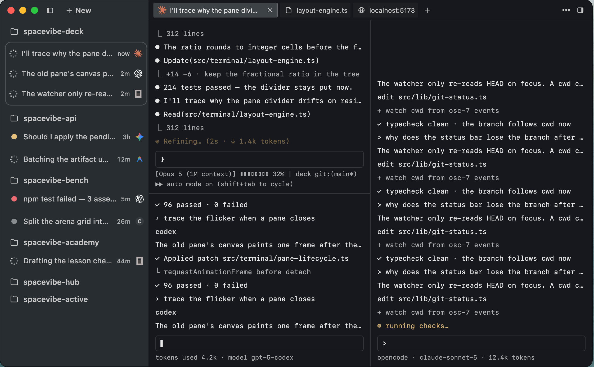

<p align="center">
  
</p>

<h1 align="center">SpaceVibe Deck</h1>

<p align="center">
  <a href="LICENSE"></a>
  <a href="https://github.com/mxrsv/spacevibe-deck/releases/latest"></a>
  
  
  
</p>

<p align="center">
  <em>A minimal desktop terminal for running many AI agent CLIs side by side.</em>
</p>

 `current`

> Formerly **Stackgrid**. Same app, new name — it now lives at [deck.spacevibe.dev](https://deck.spacevibe.dev) alongside the rest of SpaceVibe. Your settings carry over automatically on first launch.

## Why Deck?

Deck is a minimal desktop terminal built for people who run **AI agent CLIs** — Claude Code, Codex, Gemini CLI, and the like. The problem with general-purpose terminals isn't that they need to be prettier; it's that they have no affordances for **watching and steering many agents at once**.

> **Windows status:** Windows 11 x64 is an engineering preview, not a beta.
> An unsigned preview installer is published as the
> [v0.9.0-windows-preview](https://github.com/mxrsv/spacevibe-deck/releases/tag/v0.9.0-windows-preview)
> prerelease — SmartScreen will warn on install. Source and Windows desktop
> builds pass [CI](.github/workflows/ci.yml#L65-L109) `current`; runtime QA,
> screenshot and signing gates remain pending under the
> [approved Windows spec](docs/specs/2026-07-29-windows-desktop-design.md#10-verification-and-acceptance) `decided`.

Deck's whole job: open a working folder and a layout, launch an agent into every pane, read each pane's busy/idle state at a glance, rearrange panes as your attention shifts, and jump from a file path in the output straight to your editor — without turning into an IDE.

If you already live in agent CLIs and keep several running in parallel, it's built for you.

## Features

### 🖥️ Real PTY, real shell

Every pane is backed by a real PTY via Rust's `portable-pty`. macOS runs your login shell; Windows prefers PowerShell 7 and falls back to Windows PowerShell with session-only prompt integration ([Windows shell adapter](src-tauri/src/platform/windows/shell.rs#L84-L113) `current`). Full truecolor (`COLORTERM=truecolor`), UTF-8-safe reads, and platform-owned process-tree teardown keep panes isolated ([Windows session ownership](src-tauri/src/platform/windows/mod.rs#L26-L41) `current`).

### 🔲 Split panes & layouts

- Split any pane **vertically** or **horizontally** into a nested layout tree; visible shortcut labels follow the active platform ([platform keymaps](src/terminal/action-registry.ts#L513-L736) `current`).
- **Drag the dividers** to resize; each split remembers its ratio.
- **Focus** by cycling or by direction using the platform keymap.
- **Zoom** a single pane to fill the tab (tmux-style), or use **Focus Expand** to gently enlarge whichever pane is active.
- **Drag-dock** a pane by its header onto any edge of another pane to re-split on the fly.
- **Swap two panes** — hold Cmd on macOS or Ctrl on Windows while dragging a pane's header onto another pane (the target lights up as a dashed full-pane outline) to trade their positions. Each pane keeps its own session and the split ratios stay put; release the modifier mid-drag to fall back to edge docking ([primary modifier](src/lib/platform.ts#L99-L107) `current`).

### 🗂️ Workspaces & the Open board

- A **workspace** is a folder you pick as the working root. Each tab belongs to one workspace, and you can open the same workspace as many times as you like — every Open gets its own tab, so one repo can run several agent sessions side by side.
- The **Open board** is the app's single entry point (also shown on New Tab): a two-column screen — a rail of **recent workspaces** (each row removable with its × or Backspace, missing folders grouped under a one-click Remove all, Open Folder pinned at the bottom) and a detail column of **layout presets → agent** for the selected folder.
- Each recent row **remembers your last layout + agent combo** and preselects them, so reopening a project is a keystroke away — or **double-click** any workspace, layout, or agent chip to open immediately.
- Switch between a vertical **workspace sidebar** and a horizontal **tab bar** in Settings.
- **Workspace logos** — each workspace auto-detects a favicon from the repo as its icon, or drag-drop your own image onto it.
- **Agent status at a glance** — in the vertical workspace sidebar, each avatar shows a spinning ring while an agent is **actively working on a prompt** (not merely open at its prompt — Deck reads the agent's own OSC 9;4 progress reports, the same signal Ghostty renders as a progress bar), a **yellow dot** when a background tab has printed new output you haven't seen yet, and nothing when it's idle — so you can track every workspace without switching to it. Opening a tab clears its unread dot.

### 🔔 Agent attention rail

A per-pane layer on top of the status above: every pane tracks whether its agent is **working**, **finished**, **needs attention**, hit a **warning**, or hit an **error**, surfaced as a small colored dot on the same workspace sidebar avatar and on the top tab bar (whichever chrome mode you're using) — red for error, yellow for warning, magenta for needs attention, green for finished. Hover the dot for how many panes are waiting; the count stays in the tooltip rather than on the avatar, which is only 20px across.

- **Jump to what needs you** — click a status mark, or use the active platform's attention shortcut, to focus the highest-priority pane across every tab and window; repeat it to move to the next one. Focusing a pane only acknowledges that pane's own attention — a still-working agent keeps showing as working right after.
- **Native notifications, opt-in** — turn on **agent notifications** in Settings to get a background desktop notification (workspace + agent label + a one-word status, never terminal content) when an agent finishes or needs you, sent only while Deck's window isn't focused.

v1 uses one generic "needs attention" label — it doesn't yet distinguish a prompt asking for input from one asking for approval — and reads only protocol signals (OSC 9;4, OSC 9/777, the terminal bell) plus a conservative output heuristic; Deck never parses agent or terminal text to guess at attention, and this state is in-memory only, so it resets on restart.

### 🤖 Launch agents into every pane

- Pick an agent once on the Open board and Deck launches it in **every pane** of the new tab — four panes, four agents running in parallel.
- Agents are auto-discovered from the active platform environment (Claude Code, Codex, Gemini CLI). macOS uses the interactive login shell; Windows resolves allowlisted executables from `PATH` and known command suffixes ([Windows discovery](src-tauri/src/platform/windows/agent_discovery.rs#L41-L109) `current`). The **first detected agent is preselected by default** — Shell is opt-in via the **Shell only** chip (or `0`), never the silent default.
- Running agents get **chrome**: the pane header, status bar, and busy dot are colored by process — Claude magenta, Codex green, Gemini cyan — so you can read the state of every pane in one glance.

### 💾 Layout presets

Save a split layout (plus optional per-pane working directories) as a **named preset** — from a live layout or by sketching one in a mini editor. Rename, overwrite, and delete; presets persist across restarts.

### 🎨 Themes

Four built-in presets — **Tokyo Night** (default), **Dracula**, **One Dark**, and **Catppuccin Mocha** — each a full 16-color ANSI palette. Override any color (background, foreground, cursor, selection) yourself. The theme drives the app's own chrome too, not just the terminal.

### 🔗 Cmd/Ctrl+click a path or URL

Hold Cmd on macOS or Ctrl on Windows and click in any pane's output:

- a **file path** (with optional `:line:col`) opens in your editor — VS Code, Cursor, Zed, or a custom command — resolving relative paths against that pane's working directory. Windows validates structured editor intent and launches executable argv without a shell ([editor boundary](src-tauri/src/links.rs#L187-L314) `current`);
- a **URL** (including OSC 8 hyperlinks written by CLI tools) opens in your default browser.

Plain clicks still belong to the terminal, so mouse-driven TUIs (Claude Code, Codex) keep working.

### 🔍 Search & scrollback

Incremental, case-insensitive **find** in the focused pane with match counts and tick marks on the overview ruler, plus **clear buffer** to drop scrollback while keeping the current prompt. How many lines each pane keeps is configurable under Settings › Scrollback.

### 🪶 Lightweight & local-first

A native **Tauri 2** shell — no Electron. Everything stays on your machine: **no telemetry and no accounts**; network access belongs to your agents and platform bootstrap/install flows.

## How it works

Deck's model is **Window → Tab → Pane**:

- **Pane** — one visible terminal, backed by exactly one PTY.
- **Tab** — a split-layout tree of panes, bound to one **workspace** folder for its whole life.
- **Window** — owns its tabs.

A pane exposes an explicit `idle-shell`, `agent`, `busy`, or `unknown` process
kind from the active platform inspector
([PtyInfo](src-tauri/src/info.rs#L10-L34) `current`). Busy dots and close guards
consume that truth rather than guessing. Deck doesn't restore sessions across
launches: it always opens on the Open board, and you reopen folders from
Recents. Only your settings, layout presets, workspace recents, and logos
persist.

## Install

### macOS

1. Download the latest `.dmg` from [Releases](https://github.com/mxrsv/spacevibe-deck/releases/latest).
2. Drag **SpaceVibe Deck** into **Applications**.
3. First launch — the app is not signed with an Apple Developer ID yet, so macOS Gatekeeper will block it ("Apple could not verify…"). Click **Done** (not "Move to Trash"), then either:
   - Run `xattr -cr "/Applications/SpaceVibe Deck.app"` once, or
   - Open **System Settings → Privacy & Security**, scroll down and click **Open Anyway**.
   - On macOS 14 and earlier you can also right-click **SpaceVibe Deck.app** → **Open** → **Open**.

### Windows engineering preview

Download the unsigned Windows 11 x64 installer from the
[latest Windows preview prerelease](https://github.com/mxrsv/spacevibe-deck/releases/tag/v0.9.0-windows-preview).
Windows may show Microsoft Defender SmartScreen or `Unknown publisher`; this
preview is engineering test material, not a signed beta or stable Windows
release.

### Updates

Updater-enabled builds check once after launch and reveal a small `Update`
button beside Settings only when a newer release exists. Download and
installation remain separate choices: click `Update`, then click
`Install & Relaunch`. Deck refreshes every pane's process state and asks before
restarting if an agent or other process is still running
([update controller](src/updater/update-controller.ts#L82-L208) `current`). On
macOS, the application menu also exposes `Check for Updates…` for a manual
recheck and `Release Notes…` for the web changelog
([update menu actions](src/updater/update-menu-actions.ts#L62-L90) `current`).

macOS follows the latest stable release. Windows follows the separate unsigned
preview channel. Both payloads require Deck's Tauri updater signature, but the
free updater signature does not remove Gatekeeper, SmartScreen, or
`Unknown publisher` warnings. Existing v0.9.0 installations must manually
install the first updater-enabled release once.

## Keyboard shortcuts

Both platform maps come from
[`action-registry.ts`](src/terminal/action-registry.ts#L513-L736) `current`.
Bare Windows `Ctrl+C`, `Ctrl+D`, `Ctrl+W`, `Ctrl+K`, and `Ctrl+F` remain PTY
input. `Ctrl+Shift+C`/`Ctrl+Shift+V` dispatch through the shared action path —
keymap, then the `commands` table, then the pane — with paste routed through
xterm's `Terminal.paste()` for bracketed paste and CRLF normalization
([commands table](src/terminal/tab-manager.ts#L946-L1024) `current`,
[Pane clipboard](src/terminal/pane.ts#L332-L337) `current`,
[terminal-clipboard.ts](src/terminal/terminal-clipboard.ts#L27-L55) `current`).

### Windows engineering preview

| Shortcut                  | Action                                |
| ------------------------- | ------------------------------------- |
| Ctrl+Shift+C / V          | Copy selection / paste                |
| Ctrl+Alt+Shift+C          | Copy pane working directory           |
| Ctrl+Shift+D              | Split pane vertically                 |
| Ctrl+Alt+Shift+D          | Split pane horizontally               |
| Ctrl+Shift+W              | Close pane                            |
| Ctrl+Alt+Shift+W          | Close tab                             |
| Ctrl+Alt+] / [            | Focus next / previous pane            |
| Ctrl+Alt+Arrow            | Focus pane by direction               |
| Ctrl+Alt+Shift+Arrow      | Swap pane by direction                |
| Ctrl+Shift+E              | Toggle Focus Expand                   |
| Ctrl+Shift+Enter          | Zoom / restore active pane            |
| Ctrl+Shift+T              | New tab (Open board)                  |
| Ctrl+Alt+Shift+T          | Reopen closed tab                     |
| Ctrl+Alt+Shift+R          | Rename tab / change dot color         |
| Ctrl+Tab / Ctrl+Shift+Tab | Next / previous tab                   |
| Ctrl+1 … Ctrl+8 / Ctrl+9  | Select tab _N_ / last tab             |
| Ctrl+Shift+F              | Find in scrollback                    |
| F3 / Shift+F3             | Find next / previous match            |
| Ctrl+Shift+K              | Clear buffer                          |
| Ctrl+Alt+Shift+N / S      | New / save layout preset              |
| Ctrl+Shift+A              | Jump to the pane that needs attention |
| Ctrl+= / Ctrl+- / Ctrl+0  | Font zoom in / out / reset            |
| Ctrl+,                    | Toggle Settings                       |
| Shift+PgUp / PgDn         | Scroll scrollback by page             |
| Shift+Home / End          | Scroll to top / latest output         |

Open Folder uses `Ctrl+Shift+O`; preset-editor splits and pane swapping use
Ctrl as the Windows primary pointer modifier.

### macOS

**Panes**

| Shortcut   | Action                                                       |
| ---------- | ------------------------------------------------------------ |
| ⌘D         | Split pane vertically                                        |
| ⌘⇧D        | Split pane horizontally                                      |
| ⌘] / ⌘[    | Focus next / previous pane                                   |
| ⌘⌥ + ←→↑↓  | Focus pane by direction                                      |
| ⌘⌥⇧ + ←→↑↓ | Swap pane with neighbor in that direction                    |
| ⌘⇧A        | Jump to the pane that needs attention (agent attention rail) |
| ⌘⇧⏎        | Zoom / restore active pane                                   |
| ⌘E         | Toggle Focus Expand                                          |
| ⌘W         | Close pane                                                   |

**Tabs**

| Shortcut  | Action                        |
| --------- | ----------------------------- |
| ⌘T        | New tab (Open board)          |
| ⌘⇧W       | Close tab                     |
| ⌘⇧T       | Reopen closed tab             |
| ⌘⇧R       | Rename tab / change dot color |
| ⌘⇧] / ⌘⇧[ | Next / previous tab           |
| ⌘1 … ⌘8   | Select tab _N_                |
| ⌘9        | Select last tab               |

**Presets**

| Shortcut | Action                |
| -------- | --------------------- |
| ⌘⇧N      | New layout preset     |
| ⌘⇧S      | Save layout as preset |

**Terminal & view**

| Shortcut      | Action                        |
| ------------- | ----------------------------- |
| ⌘F            | Find in scrollback            |
| ⌘G / ⌘⇧G      | Find next / previous match    |
| ⌘K            | Clear buffer                  |
| ⌘⇧C           | Copy pane's working directory |
| ⇧PgUp / ⇧PgDn | Scroll scrollback by page     |
| ⇧Home / ⇧End  | Scroll to top / latest output |
| ⌘+ / ⌘- / ⌘0  | Font zoom in / out / reset    |
| ⌘,            | Toggle Settings               |
| ⌘Q            | Quit                          |

Shift+Enter sends the terminal newline binding used by agent CLIs
([implementation](src/terminal/shift-enter.ts#L20-L62) `current`).

## Settings

Open **Settings** from the toolbar (or the platform Settings shortcut) to configure:

- **Font** family and size (default SF Mono, 13px), plus live font zoom.
- **Theme** and per-color overrides.
- **Editor** for Cmd/Ctrl+click — VS Code, Cursor, Zed, or a custom command.
- **Tab bar position** — left sidebar or top bar.
- **Scrollback** — lines kept per pane (1k … 100k).
- **Focus Expand** and **pane bar** toggles.

Settings, layout presets, workspace recents, and logos are stored as JSON via the Tauri store; the panel has a **Restore defaults** button.

## Build from source

Requires Node.js 20+, Rust (stable), and the Tauri 2 prerequisites for the host
platform.

```bash
npm install
npm run tauri dev     # development
npm run tauri build   # release build → src-tauri/target/release/bundle/
```

## Tech stack

- **[Tauri 2](https://tauri.app)** — native desktop shell (Rust), real PTYs via `portable-pty`.
- **[xterm.js 6](https://xtermjs.org)** — terminal rendering, with the fit / search / unicode-graphemes addons.
- **[Preact](https://preactjs.com)** + `@preact/signals` — UI.
- **TypeScript**, **[Vite 6](https://vite.dev)**, **Vitest**.

## License

[MIT](LICENSE) `current` © 2026 mxrsv

## Chưa khớp thực tế

_(reality-drift ledger — heading text mandated by the global docs convention)_

| Claim | Intent | Status | Evidence |
| ----- | ------ | ------ | -------- |

Empty — verified 2026-08-01. The Windows-status drift found by the
[2026-08-01 audit](docs/review/2026-08-01-doc-drift.md) `current` was resolved
the same day by rewriting the status block above. Do not remove this section
(D7).
