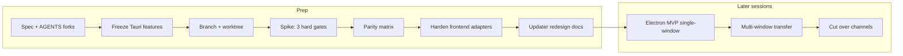

# Electron Migration Prep Plan

**Status:** `current` — prep in progress. Revised 2026-08-11 after a strategy review (findings folded in below); §0.2 and §5 were resolved on 2026-08-11 and are annotated in place. Tasks 1–3 are done and Task 4's baseline passed; Gates A and C are blocked, Gate B is partial. Task 6 stays closed until the spike passes.

**Goal:** Prepare Deck to leave Tauri for Electron (Node/TS host rewrite) without shipping product code until a design spec is approved and the spike clears three hard gates.

**Architecture:** Freeze Tauri feature work (hotfixes only). Prove the risky host seams on a dedicated branch + worktree _before_ touching renderer code. Extract host facades only once the spike passes. Redesign updater/channels on paper. Full Electron MVP / multi-window / cutover are later plans.

**Tech Stack (target):** Electron main (TypeScript), Preact + xterm renderer (kept), `node-pty`, `electron-store` or app-data JSON, `electron-updater`, `electron-builder` (or equivalent). No Rust NAPI/sidecar — see the abort criterion in §0.2.

**Source spec:** [`docs/specs/2026-08-11-electron-migration-design.md`](../specs/2026-08-11-electron-migration-design.md) — **written 2026-08-11, pending user approval** (Task 2). Until it is approved, do not scaffold Electron inside the product tree.

---

## 0. Decisions (locked 2026-08-11)

Record these in [`AGENTS.md`](../../AGENTS.md) In flight and [`docs/CONTEXT.md`](../CONTEXT.md) in the same prep pass.

1. **Why:** ship speed and DX — main process in Node/TS, less Rust/Tauri friction.
2. **Host:** full rewrite in Node/TS (`node-pty`, `BrowserWindow`, `electron-updater`). Rejected: Rust NAPI/sidecar; long-lived dual-runtime.
3. **Cutover policy:** freeze features on Tauri; hotfix only for `releases/latest` and Windows preview. New features (token usage dashboard, pane-detach Phase B, …) land on Electron only.
4. **Product constraints that survive:** real multi-pane PTYs; auto-update with explicit Install & Relaunch; local-first; macOS public + unsigned Windows preview until Authenticode.
5. **Git isolation:** dedicated branch **and** dedicated worktree. Primary checkout stays on the shipping branch for Tauri hotfixes. Second worktree binds `electron-migration` for scaffolds, spikes, and long-running adapter work. Electron pulls native `node-pty` / Electron binaries — sharing one working tree fights `npm install` and dirty hotfixes. Docs-only fork/spec edits may happen on the primary checkout; anything that adds Electron deps or scaffolds runs only in the worktree. Worktree convention for this repo: `~/Documents/Development/spacevibe-deck-worktrees/<name>`.
6. **Apple Developer Program — buying in (2026-08-11).** `electron-updater` on macOS goes through Squirrel.Mac, which refuses to update an app that is not signed with a Developer ID and notarized. Deck ships **unsigned** on macOS today — [`.github/workflows/release.yml`](../../.github/workflows/release.yml) carries only `TAURI_SIGNING_PRIVATE_KEY` (Minisign), no Apple identity — and the Tauri updater works anyway because it verifies its own Minisign signature. Electron removes that option: without a paid Apple identity there is **no auto-update on macOS at all**, which would break constraint 4. Decision: buy the Apple Developer Program, sign with `Developer ID Application`, and notarize. Windows stays unsigned preview (existing B2 decision) — whether `electron-updater` updates an unsigned NSIS build is a spike question, not an assumption.
7. **Cutover is a clean install; app data is NOT migrated (2026-08-11).** Existing users download the Electron build by hand and start from an empty profile — settings, workspaces, presets, prompt templates and `customAgents` are gone. Consequences accepted on purpose: no Minisign key reuse, no handoff release, no `migrate.rs` equivalent, no export/import UI on either side. The cost is real — a user with a configured prompt board and several declared agents has a genuine reason not to move — and is accepted rather than overlooked.
8. **Last-mile notice for field installs (follows from 7).** Users on 0.12.x will otherwise sit on a version that silently never updates again. Before the channels are retired, ship a final Tauri release (or final `latest.json`) whose notes say the next version must be downloaded by hand, and point the landing at the Electron artifacts. Cheap mitigation for 7, no code: a doc page naming the old store path so anyone who wants their config back can copy it by hand.

Sunk cost (do not try to “port” as-is): hardened Tauri updater fork pin; pane-detach Phase A Rust coordinator. Re-implement behavior in TypeScript.

### 0.1 Global constraints

- **R1 — English only** for every string, comment, test name, commit message, and doc line in this repo.
- **R2 —** `docs/DESIGN-LANGUAGE.md` rule changes are a fork — stop and ask.
- **Bundle / signing / release** changes are a fork — prep redesigns them in the spec only; do not change CI or channels until a later plan.
- **Adding a dependency** that ships in the app bundle is a fork — the spike may install Electron/`node-pty` in the worktree once the spec allows it; product `package.json` changes wait for the MVP plan.
- This repo uses **npm**, not pnpm.
- Verification while still on Tauri: `npm test`, `npm run build` (`tsc && vite build`). No separate `lint` script.

### 0.2 Abort criteria and time-box

**RESOLVED 2026-08-11 — the two time-boxes below were REPLACED, not confirmed.** The freeze ends on **gates, not dates**: it lifts when gates A, B and C have each reached a conclusion, and an abort is a conclusion. Reason: the motivation ("ship speed and DX") has never been measured in hours or build minutes, so any deadline would be a guess enforced against real work. Accepted cost, named rather than discovered later: a hanging gate hangs the freeze, and Gate C is hardware-blocked today. Recorded in [`AGENTS.md`](../../AGENTS.md) In flight and the [design spec](../specs/2026-08-11-electron-migration-design.md) §4. The two bullets below are kept only as the superseded proposal — **do not execute them**. The third bullet stands unchanged.

- ~~**Spike (Task 4): 1 week.**~~ All three gates must clear. Any gate still open at the deadline stops the migration for a re-decision rather than sliding.
- ~~**MVP parity: 6 weeks from spike pass.**~~ If multi-pane PTY + settings + native menu are not working, **unfreeze Tauri**, resume the token usage dashboard, and demote Electron to background work — the outcome survives, the six-week trigger does not.
- **Written abort criterion — the "pure Node/TS" claim.** If Windows kill-tree or process inspection cannot be done without a native addon, decision 2 was wrong and must be reopened explicitly. Do not quietly add a native addon and carry on: that outcome removes most of the DX argument that motivates this migration.

---

## 1. Prep scope (this plan)

Done when all tasks below are checked and the design spec is approved. This plan does **not** implement full Electron.

The ordering changed in the 2026-08-11 revision: the spike now runs **before** the adapter refactor. Task 6 touches 44 renderer files; running it before anything is de-risked would be the most expensive step spent on an unproven branch.

**Out of prep scope:**

- Delete [`src-tauri`](../../src-tauri)
- Change README marketing (“no Electron”) — see §5, open question A
- Change `releases/latest` or Windows preview channels
- Implement token dashboard or Phase B on Tauri
- Port the full pane-transfer coordinator before spike + approved MVP plan
- Sign the final Tauri build with the newly bought Apple identity. Worth doing (it removes the Gatekeeper warning on the last build users download by hand) but it is a release-config fork and belongs to the cutover plan, not here.

---

## 2. Tasks

### Task 1: Record forks

- [x] Add In flight bullets to [`AGENTS.md`](../../AGENTS.md): Electron rewrite (why / host / freeze / branch+worktree), the Apple Developer purchase (§0 item 6), the clean-install cutover (§0 item 7), and a pointer to this plan and the forthcoming spec.
- [x] Short status note in [`docs/CONTEXT.md`](../CONTEXT.md).
- [x] Freeze text: no new Tauri features; hotfixes OK; token dashboard + Phase B wait for Electron. Include the time-box from §0.2 so the freeze has an end condition.

### Task 2: Write design spec

- [x] Author [`docs/specs/2026-08-11-electron-migration-design.md`](../specs/2026-08-11-electron-migration-design.md) (English, R1).
- [x] Lock: motivation; rejected alternatives; target stack; three ship phases (MVP → multi-window → updater/channels); failure modes (main-process quit/close census; Windows kill-tree; transfer fail-safe); Done / Not done for prep vs MVP vs cutover; binary size/RAM accepted for DX.
- [x] Lock the two decisions from §0 items 6–8: signing/notarization as a hard prerequisite, and clean install with no data migration plus the final-notice release.
- [x] Self-review (placeholders, consistency, scope, ambiguity).
- [ ] **Hard gate:** user approves the spec before scaffolding Electron in-repo.

### Task 3: Branch + worktree

- [x] `git worktree add ~/Documents/Development/spacevibe-deck-worktrees/electron-migration -b electron-migration`.
- [x] All later tasks that touch deps or Electron code run in that worktree only. Note that the primary checkout currently carries uncommitted work; a worktree cut from `HEAD` will not include it.

### Task 4: Spike — three hard gates (worktree; not product path)

Runs before any renderer refactor. Isolated spike folder inside the `electron-migration` worktree (or scratch outside the repo per F4), never wired into shipping entrypoints. The spike exists to answer the questions that can kill the migration, not to prove that a shell renders.

- [x] Baseline: Electron window loads a Vite/Preact stub; one `node-pty` session spawns a shell, streams to xterm, resizes, kills.
- [x] Confirm macOS login-shell / user PATH parity with today’s behavior ([`agents.rs`](../../src-tauri/src/agents.rs) detects agents through a login shell with a 3 s timeout).
- [ ] **Gate A — updater:** `electron-updater` completes discover → verify → download → install → relaunch on a **signed and notarized** macOS build. This is the same class of manual proof v0.11.0 required; unit tests do not cover it. Also record what `electron-updater` does with an _unsigned_ Windows NSIS build, since Windows stays unsigned.
- [ ] **Gate B — native build in CI:** `node-pty` builds for a universal macOS binary (arm64 + x64) inside GitHub Actions. **Partial 2026-08-11 — everything but the CI run is done:** a universal `.app` builds locally and passes the spike 7/7 from the bundle, and `node-pty` 1.1.0 turned out to be pure N-API, so the feared per-Electron-ABI rebuild problem does not exist. What remains is one Actions run, which needs a branch pushed. Findings and the required packaging config are in [`docs/CONTEXT.md`](../CONTEXT.md).
- [ ] **Gate C — Windows process semantics:** decide whether kill-tree and process inspection have a pure-Node path. Today: [`job_object.rs`](../../src-tauri/src/platform/windows/job_object.rs) creates a Job Object with kill-on-close and assigns the PID; [`process_snapshot.rs`](../../src-tauri/src/platform/windows/process_snapshot.rs) (682 LOC) classifies the process tree into `IdleShell` / `Agent` / `Busy`, which feeds attention state and the quit census. No Windows machine is available, so this gate is **blocked on hardware** — say so out loud rather than downgrading it to a note.
- [x] Land findings in [`docs/CONTEXT.md`](../CONTEXT.md).
- [ ] Only after all three gates: author [`docs/plans/2026-08-11-electron-mvp.md`](./2026-08-11-electron-mvp.md) in a later session.

### Task 5: Parity matrix

Living checklist in the spec (or append here). Each row: seam → today’s path → Electron target → phase → rough acceptance. The 2026-08-11 revision added the bottom eight rows; the earlier nine-row version covered under half of the 10,504 LOC in [`src-tauri/src`](../../src-tauri/src).

| Seam                                   | Today                                                                                                                                | Electron target                                                                             | Phase   | Risk                                    |
| -------------------------------------- | ------------------------------------------------------------------------------------------------------------------------------------ | ------------------------------------------------------------------------------------------- | ------- | --------------------------------------- |
| PTY spawn/read/write/resize/kill       | `portable-pty` / [`pty.rs`](../../src-tauri/src/pty.rs)                                                                              | `node-pty` + main ownership                                                                 | MVP     | 🟡                                      |
| Process inspect / agent detect         | [`info.rs`](../../src-tauri/src/info.rs), platform modules                                                                           | Node process helpers                                                                        | MVP     | 🟡                                      |
| Store                                  | `@tauri-apps/plugin-store`                                                                                                           | `electron-store` or app-data JSON                                                           | MVP     | 🟢 (no migration — §0 item 7)           |
| Dialog / clipboard / notify / open URL | Tauri plugins                                                                                                                        | Electron `dialog`, `clipboard`, `Notification`, `shell.openExternal`                        | MVP     | 🟢                                      |
| Native menu + action registry          | generated [`menu_registry.rs`](../../src-tauri/src/menu_registry.rs)                                                                 | `Menu.buildFromTemplate` from [`action-registry.ts`](../../src/terminal/action-registry.ts) | MVP     | 🟡                                      |
| Quit/close census                      | Rust flights                                                                                                                         | main-process flights                                                                        | MVP     | 🟡 depends on the Windows row below     |
| Multi-window transfer                  | [`coordinator.rs`](../../src-tauri/src/coordinator.rs) (1,824 LOC)                                                                   | main-process TS coordinator                                                                 | Phase 2 | 🟡                                      |
| Updater                                | forked Tauri updater + channels                                                                                                      | `electron-updater` + new channel layout                                                     | Phase 3 | 🟡 gated on signing                     |
| Release CI                             | `tauri-action`                                                                                                                       | `electron-builder` (or equivalent) + notarize                                               | Phase 3 | 🟡                                      |
| **Windows kill-tree**                  | [`job_object.rs`](../../src-tauri/src/platform/windows/job_object.rs) — Job Object, kill-on-close, assign PID                        | no Node binding exists; native addon, `taskkill /T /F`, or ConPTY behavior                  | MVP     | 🔴 abort criterion §0.2                 |
| **Windows process snapshot**           | [`process_snapshot.rs`](../../src-tauri/src/platform/windows/process_snapshot.rs) — `IdleShell`/`Agent`/`Busy` from the process tree | `ps-list` / PowerShell / native                                                             | MVP     | 🔴 wrong output breaks attention and ⌘Q |
| **Login-shell agent detect**           | [`agents.rs`](../../src-tauri/src/agents.rs) + [`macos.rs`](../../src-tauri/src/platform/macos.rs), `command -v`, 3 s timeout        | `child_process` login shell, same timeout                                                   | MVP     | 🟡                                      |
| **Shell integration**                  | [`shell_integration.rs`](../../src-tauri/src/shell_integration.rs) — OSC 133 parser, 128 KB pending cap                              | pure TS port                                                                                | MVP     | 🟢 logic-only, ports 1:1                |
| **Link resolve**                       | [`links.rs`](../../src-tauri/src/links.rs) (993 LOC, Windows branch)                                                                 | TS + `shell.openExternal`                                                                   | MVP     | 🟡 volume                               |
| **Prompt assets scan**                 | [`prompt_assets.rs`](../../src-tauri/src/prompt_assets.rs) (692 LOC)                                                                 | `fs` in main process                                                                        | MVP     | 🟢                                      |
| **Window lifecycle**                   | [`window_lifecycle.rs`](../../src-tauri/src/window_lifecycle.rs) — label alloc, MRU, pending adoption                                | main-process TS, same contract                                                              | Phase 2 | 🟡                                      |
| **Logo / images**                      | [`images.rs`](../../src-tauri/src/images.rs) — data URL, 1 MB cap                                                                    | `fs` + base64                                                                               | MVP     | 🟢                                      |

Explicitly **not** carried over: updater fork pin, `tauri.conf` capabilities, WebView2 harden, `data-tauri-drag-region` (replace with Electron title-bar style), [`migrate.rs`](../../src-tauri/src/migrate.rs) (no data migration — §0 item 7).

### Task 6: Harden host adapters (still Tauri-backed)

**Runs only after Task 4 passes.** Goal: renderer almost never imports `@tauri-apps/*` outside adapter modules.

Existing seeds: [`src/terminal/pty-client.ts`](../../src/terminal/pty-client.ts), [`src/terminal/transfer-client.ts`](../../src/terminal/transfer-client.ts), [`src/updater/tauri-updater-adapter.ts`](../../src/updater/tauri-updater-adapter.ts), settings sync client.

- [ ] Inventory remaining `@tauri-apps/*` — 44 files today (34 hits on `@tauri-apps/api`, then `plugin-store`, `plugin-dialog`, `plugin-opener`, `plugin-notification`, `plugin-updater`, `plugin-process`, `plugin-clipboard-manager`), plus `data-tauri-drag-region`.
- [ ] Consolidate behind stable facades under `src/host/` (or extend existing clients): `PtyHost`, `WindowHost`, `StoreHost`, `DialogHost`, `UpdaterHost`, `MenuHost`.
- [ ] Keep behavior identical; update Vitest mocks to the facades.
- [ ] Preserve the idea behind [`scripts/ipc-contract.test.ts`](../../scripts/ipc-contract.test.ts) for a future Electron `ipcMain.handle` ↔ `ipcRenderer.invoke` check, and write that Electron equivalent from the MVP onward — it is the only gate in this repo that crosses the IPC boundary, and the `open_pane_window` bug proved what escapes without it.
- [ ] Verify: `npm test`, `npm run build`. **These are weak evidence on their own** — the suite mocks `@tauri-apps/*`, so swapping imports keeps it green by construction. Add a manual pass under `npm run tauri dev`: open pane, split, switch preset, settings, prompt board, ⌘⇧M detach, and quit with a busy pane.

### Task 7: Release / updater redesign (docs only)

In the design spec (no CI edits):

- [ ] Signing prerequisites, now that §0 item 6 is decided: `Developer ID Application` certificate, notarize + staple in the release job, and the CI secrets that do not exist yet (`CSC_LINK`, `CSC_KEY_PASSWORD`, `APPLE_ID`, `APPLE_APP_SPECIFIC_PASSWORD`, `APPLE_TEAM_ID`). Windows stays unsigned preview until Authenticode (B2).
- [ ] Do not reuse the Tauri Minisign public key for Electron; field Tauri binaries keep the old channels until cutover.
- [ ] Cutover story: landing download pins to Electron artifacts; map or replace `windows-preview-channel` / `latest.json` with `electron-updater` `latest.yml` (or chosen layout). Fold in the in-flight decision to collapse the GitHub release list to one release per version — the two overlap directly.
- [ ] Final-notice release for field installs, plus the doc page naming the old store path (§0 item 8).
- [ ] Single-flight update + busy-pane guard live in the main process (port intent from [`update_flight.rs`](../../src-tauri/src/update_flight.rs) + frontend controller).

---

## 3. Risks

- **Windows without Rust is the top risk.** Kill-tree ([`job_object.rs`](../../src-tauri/src/platform/windows/job_object.rs)) and process classification ([`process_snapshot.rs`](../../src-tauri/src/platform/windows/process_snapshot.rs)) are ~1,100 audited LOC with no Node equivalent, and no Windows machine is available to test a replacement. This is what the §0.2 abort criterion exists for.
- **Losing user config loses users.** §0 item 7 accepts that anyone with configured agents, prompt templates and workspaces rebuilds from scratch. That is a real reason to stay on 0.12.x forever.
- **Positioning.** “No Electron” is a public proof point ([`README.md`](../../README.md) line 101, [`marketing/landing-prototype/src/copy.js`](../../marketing/landing-prototype/src/copy.js) lines 67–68, both languages). Removing it needs a replacement claim, not just a copy edit — see §5, open question A.
- **The updater trap repeats.** The updater that runs an upgrade lives in the OLD build, which is why v0.11.0 existed. Switching updater implementations re-enters that trap with code this project has never operated.
- Hardened updater + pane-detach Phase A Rust work is sunk; Electron reimplements behavior.
- Electron binary size and RAM are larger than Tauri; accepted for DX (state in spec Decisions).
- Users on current Tauri releases stand still on features until cutover; the hotfix path must keep working.

---

## 4. Next after this plan

1. User answers the open questions in §5.
2. User approves the design spec.
3. Spike clears gates A, B and C.
4. New implementation plan: `docs/plans/2026-08-11-electron-mvp.md` (single-window parity).
5. Later: multi-window transfer plan; updater/channel cutover plan.

---

## 5. Open questions — BOTH ANSWERED 2026-08-11

**No longer blocking.** The answers live in [`AGENTS.md`](../../AGENTS.md) In flight, [`docs/CONTEXT.md`](../CONTEXT.md), and the [design spec](../specs/2026-08-11-electron-migration-design.md) §4. Summary:

- **A — answered:** lead with "no accounts, no telemetry" and promote "made for agent CLIs". Deliberately **not** a performance claim — Electron would make one false. The copy in [`README.md`](../../README.md) and [`copy.js`](../../marketing/landing-prototype/src/copy.js) is NOT edited by prep or MVP; it stays true while Tauri ships, and the edit belongs to the cutover plan.
- **B — answered by replacement:** gate-based, not date-based. See §0.2 above.

The original text of both questions follows, kept for the reasoning rather than as live questions.

**A — What replaces “no Electron” as a proof point?** The claim is currently load-bearing on the landing and in the README. Surviving true claims after the migration: local-first with no telemetry and no accounts (Warp requires a login); a real PTY per pane rather than a wrapper; built for agent CLIs — agent detection, attention state, prompt board, presets. Suggested replacement: lead with “no accounts, no telemetry” and promote “made for agent CLIs”, and do not replace it with any performance claim. Marketing decision; it does not block the spike, only the cutover.

**B — Confirm or replace the §0.2 numbers.** 1 week for the spike, 6 weeks to MVP parity, then unfreeze Tauri. The numbers are a proposal from the review; the freeze needs _some_ end condition, otherwise feature work stops indefinitely against a motivation (“ship speed and DX”) that has never been measured in hours or in build minutes.
